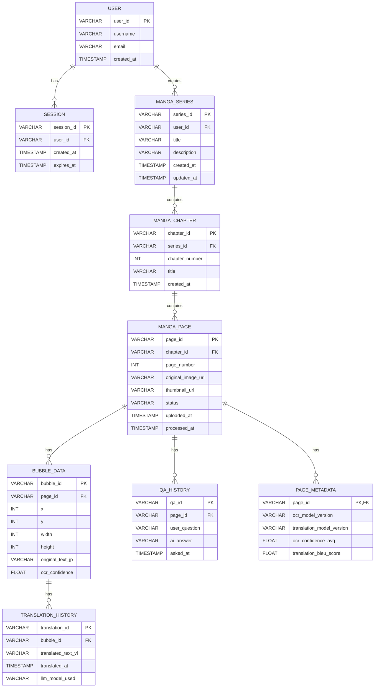

# Database Schema - StoryLens

## 1. Introduction
### 1.1 Purpose
Tài liệu này mô tả cấu trúc cơ sở dữ liệu cho hệ thống StoryLens, bao gồm các bảng, trường, kiểu dữ liệu, khóa chính, khóa ngoại và mối quan hệ giữa các bảng. Mục tiêu là cung cấp một bản thiết kế rõ ràng cho việc triển khai và quản lý cơ sở dữ liệu.

### 1.2 Scope
Schema này bao gồm các bảng cần thiết để lưu trữ thông tin về người dùng, manga pages, dữ liệu xử lý (OCR, dịch), lịch sử và các thông tin liên quan đến RAG Q&A.

---

## 2. Entity-Relationship Diagram (Conceptual)

---

## 3. Table Descriptions

### 3.1 `USER` Table
Lưu trữ thông tin người dùng.

| Tên trường | Kiểu dữ liệu | Mô tả | Ràng buộc |
| :--- | :--- | :--- | :--- |
| `user_id` | `VARCHAR(36)` | ID duy nhất của người dùng | PRIMARY KEY |
| `username` | `VARCHAR(50)` | Tên đăng nhập | UNIQUE, NOT NULL |
| `email` | `VARCHAR(100)` | Địa chỉ email | UNIQUE, NOT NULL |
| `created_at` | `TIMESTAMP` | Thời gian tạo tài khoản | NOT NULL, DEFAULT CURRENT_TIMESTAMP |

### 3.2 `SESSION` Table
Lưu trữ thông tin phiên làm việc của người dùng.

| Tên trường | Kiểu dữ liệu | Mô tả | Ràng buộc |
| :--- | :--- | :--- | :--- |
| `session_id` | `VARCHAR(36)` | ID duy nhất của phiên | PRIMARY KEY |
| `user_id` | `VARCHAR(36)` | ID người dùng | FOREIGN KEY (`USER.user_id`) |
| `created_at` | `TIMESTAMP` | Thời gian tạo phiên | NOT NULL, DEFAULT CURRENT_TIMESTAMP |
| `expires_at` | `TIMESTAMP` | Thời gian hết hạn phiên | NOT NULL |

### 3.3 `MANGA_SERIES` Table
Lưu trữ thông tin về các series manga do người dùng tạo.

| Tên trường | Kiểu dữ liệu | Mô tả | Ràng buộc |
| :--- | :--- | :--- | :--- |
| `series_id` | `VARCHAR(36)` | ID duy nhất của series | PRIMARY KEY |
| `user_id` | `VARCHAR(36)` | ID người dùng sở hữu series | FOREIGN KEY (`USER.user_id`) |
| `title` | `VARCHAR(255)` | Tiêu đề series | NOT NULL |
| `description` | `TEXT` | Mô tả series | |
| `created_at` | `TIMESTAMP` | Thời gian tạo series | NOT NULL, DEFAULT CURRENT_TIMESTAMP |
| `updated_at` | `TIMESTAMP` | Thời gian cập nhật cuối cùng | NOT NULL, DEFAULT CURRENT_TIMESTAMP ON UPDATE CURRENT_TIMESTAMP |

### 3.4 `MANGA_CHAPTER` Table
Lưu trữ thông tin về các chapter trong một series manga.

| Tên trường | Kiểu dữ liệu | Mô tả | Ràng buộc |
| :--- | :--- | :--- | :--- |
| `chapter_id` | `VARCHAR(36)` | ID duy nhất của chapter | PRIMARY KEY |
| `series_id` | `VARCHAR(36)` | ID series mà chapter thuộc về | FOREIGN KEY (`MANGA_SERIES.series_id`), NOT NULL |
| `chapter_number` | `INT` | Số thứ tự của chapter | NOT NULL |
| `title` | `VARCHAR(255)` | Tiêu đề chapter | |
| `created_at` | `TIMESTAMP` | Thời gian tạo chapter | NOT NULL, DEFAULT CURRENT_TIMESTAMP |

### 3.5 `MANGA_PAGE` Table
Lưu trữ thông tin về từng trang manga.

| Tên trường | Kiểu dữ liệu | Mô tả | Ràng buộc |
| :--- | :--- | :--- | :--- |
| `page_id` | `VARCHAR(36)` | ID duy nhất của trang | PRIMARY KEY |
| `chapter_id` | `VARCHAR(36)` | ID chapter mà trang thuộc về | FOREIGN KEY (`MANGA_CHAPTER.chapter_id`) |
| `page_number` | `INT` | Số thứ tự của trang trong chapter | NOT NULL |
| `original_image_url` | `VARCHAR(255)` | URL ảnh gốc | NOT NULL |
| `thumbnail_url` | `VARCHAR(255)` | URL ảnh thumbnail | |
| `status` | `VARCHAR(50)` | Trạng thái xử lý (pending, ocr_failed, translated, completed) | NOT NULL |
| `uploaded_at` | `TIMESTAMP` | Thời gian tải lên | NOT NULL, DEFAULT CURRENT_TIMESTAMP |
| `processed_at` | `TIMESTAMP` | Thời gian xử lý hoàn tất | |

### 3.6 `PAGE_METADATA` Table
Lưu trữ các thông tin metadata liên quan đến quá trình xử lý AI của từng trang.

| Tên trường | Kiểu dữ liệu | Mô tả | Ràng buộc |
| :--- | :--- | :--- | :--- |
| `page_id` | `VARCHAR(36)` | ID của trang | PRIMARY KEY, FOREIGN KEY (`MANGA_PAGE.page_id`) |
| `ocr_model_version` | `VARCHAR(50)` | Phiên bản model OCR đã dùng | |
| `translation_model_version` | `VARCHAR(50)` | Phiên bản model dịch đã dùng | |
| `ocr_confidence_avg` | `FLOAT` | Độ tin cậy trung bình của OCR | |
| `translation_bleu_score` | `FLOAT` | Điểm BLEU của bản dịch (nếu có) | |

### 3.7 `BUBBLE_DATA` Table
Lưu trữ dữ liệu về từng bubble thoại trên trang manga.

| Tên trường | Kiểu dữ liệu | Mô tả | Ràng buộc |
| :--- | :--- | :--- | :--- |
| `bubble_id` | `VARCHAR(36)` | ID duy nhất của bubble | PRIMARY KEY |
| `page_id` | `VARCHAR(36)` | ID trang mà bubble thuộc về | FOREIGN KEY (`MANGA_PAGE.page_id`), NOT NULL |
| `x` | `INT` | Tọa độ X của bubble | NOT NULL |
| `y` | `INT` | Tọa độ Y của bubble | NOT NULL |
| `width` | `INT` | Chiều rộng của bubble | NOT NULL |
| `height` | `INT` | Chiều cao của bubble | NOT NULL |
| `original_text_jp` | `TEXT` | Văn bản tiếng Nhật gốc trong bubble | |
| `ocr_confidence` | `FLOAT` | Độ tin cậy của OCR cho bubble này | |

### 3.8 `TRANSLATION_HISTORY` Table
Lưu trữ lịch sử các bản dịch cho từng bubble.

| Tên trường | Kiểu dữ liệu | Mô tả | Ràng buộc |
| :--- | :--- | :--- | :--- |
| `translation_id` | `VARCHAR(36)` | ID duy nhất của bản dịch | PRIMARY KEY |
| `bubble_id` | `VARCHAR(36)` | ID bubble được dịch | FOREIGN KEY (`BUBBLE_DATA.bubble_id`), NOT NULL |
| `translated_text_vi` | `TEXT` | Văn bản đã dịch sang tiếng Việt | |
| `translated_at` | `TIMESTAMP` | Thời gian dịch | NOT NULL, DEFAULT CURRENT_TIMESTAMP |
| `llm_model_used` | `VARCHAR(50)` | Model LLM đã dùng để dịch | |

### 3.9 `QA_HISTORY` Table
Lưu trữ lịch sử các câu hỏi và trả lời RAG Q&A.

| Tên trường | Kiểu dữ liệu | Mô tả | Ràng buộc |
| :--- | :--- | :--- | :--- |
| `qa_id` | `VARCHAR(36)` | ID duy nhất của phiên Q&A | PRIMARY KEY |
| `page_id` | `VARCHAR(36)` | ID trang liên quan (nếu có) | FOREIGN KEY (`MANGA_PAGE.page_id`) |
| `user_question` | `TEXT` | Câu hỏi của người dùng | NOT NULL |
| `ai_answer` | `TEXT` | Câu trả lời của AI | |
| `asked_at` | `TIMESTAMP` | Thời gian hỏi | NOT NULL, DEFAULT CURRENT_TIMESTAMP |
