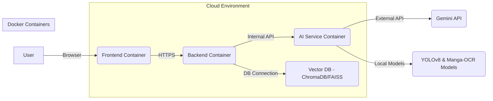

# Deployment Guide - StoryLens

## 1. Introduction
### 1.1 Purpose
Tài liệu này cung cấp hướng dẫn chi tiết về cách triển khai hệ thống StoryLens lên môi trường sản xuất. Nó bao gồm các bước cấu hình, cài đặt phụ thuộc, triển khai các thành phần frontend, backend và AI, cũng như các khuyến nghị về giám sát và bảo trì.

### 1.2 Scope
Hướng dẫn này bao gồm việc triển khai các thành phần chính của StoryLens: Frontend (React/Vite), Backend (FastAPI), các dịch vụ AI (YOLOv8, Manga-OCR, RAG) và cơ sở dữ liệu (Vector DB). Nó tập trung vào môi trường cloud (ví dụ: Railway/Render) nhưng cũng có thể áp dụng cho các môi trường khác với một số điều chỉnh.

---

## 2. Prerequisites
Trước khi bắt đầu triển khai, hãy đảm bảo rằng bạn đã có các tài nguyên và công cụ sau:

- **Tài khoản Cloud:** Tài khoản trên một nền tảng cloud như Railway, Render, AWS, GCP, Azure, v.v.
- **Docker & Docker Compose:** Để đóng gói và chạy các dịch vụ.
- **Git:** Để clone mã nguồn.
- **Python 3.9+ & pip:** Để cài đặt các phụ thuộc Python.
- **Node.js & npm/yarn:** Để cài đặt các phụ thuộc Frontend.
- **API Keys:**
    - Google Gemini API Key.
    - Các API key khác nếu có (ví dụ: cho dịch vụ lưu trữ ảnh S3).

---

## 3. Deployment Architecture

StoryLens được thiết kế để triển khai dưới dạng các microservice hoặc dịch vụ độc lập, cho phép mở rộng và quản lý dễ dàng. Các thành phần chính sẽ được đóng gói trong Docker containers.



---

## 4. Deployment Steps

### 4.1 Clone Repository
```bash
git clone https://github.com/your-repo/storylens.git
cd storylens
```

### 4.2 Environment Variables Configuration
Tạo file `.env` trong thư mục gốc của dự án và điền các biến môi trường cần thiết:

```dotenv
# Backend Configuration
GEMINI_API_KEY=YOUR_GEMINI_API_KEY
DATABASE_URL=sqlite:///./sql_app.db # For local development, or your production DB URL
# ... other backend specific variables

# Frontend Configuration
VITE_API_BASE_URL=https://api.storylens.com/v1 # Your deployed backend URL
# ... other frontend specific variables
```

### 4.3 Docker-based Deployment (Recommended)

#### 4.3.1 Build Docker Images
```bash
docker-compose build
```

#### 4.3.2 Run Containers
```bash
docker-compose up -d
```

#### 4.3.3 Verify Deployment
- Truy cập Frontend tại `http://localhost:3000` (hoặc cổng đã cấu hình).
- Kiểm tra log của các container để đảm bảo không có lỗi.

### 4.4 Manual Deployment (Alternative)

#### 4.4.1 Frontend Deployment
1.  **Cài đặt phụ thuộc:**
    ```bash
    cd frontend
    npm install # hoặc yarn install
    ```
2.  **Build ứng dụng:**
    ```bash
    npm run build # hoặc yarn build
    ```
3.  **Triển khai:** Copy thư mục `dist` lên web server (Nginx, Apache) hoặc dịch vụ hosting tĩnh (Railway Static App, Render Static Site).

#### 4.4.2 Backend Deployment
1.  **Cài đặt phụ thuộc:**
    ```bash
    cd backend
    pip install -r requirements.txt
    ```
2.  **Chạy ứng dụng:**
    ```bash
    uvicorn main:app --host 0.0.0.0 --port 8000
    ```
    - Đối với môi trường production, sử dụng Gunicorn kết hợp với Uvicorn worker.
    - Triển khai lên các dịch vụ như Railway Service, Render Web Service, hoặc Kubernetes.

#### 4.4.3 AI Services Deployment
- Các mô hình AI (YOLOv8, Manga-OCR) có thể được tải và chạy cục bộ trong container của Backend hoặc trong một dịch vụ AI riêng biệt.
- Đảm bảo các model weights được tải xuống hoặc bao gồm trong Docker image.

---

## 5. Post-Deployment Configuration

### 5.1 Domain Configuration
- Cấu hình DNS để trỏ domain của bạn đến địa chỉ IP hoặc URL của dịch vụ đã triển khai.
- Thiết lập SSL/TLS (Let's Encrypt) để đảm bảo kết nối HTTPS.

### 5.2 Monitoring and Logging
- Tích hợp các công cụ giám sát (Prometheus, Grafana) để theo dõi hiệu suất hệ thống.
- Cấu hình hệ thống ghi log tập trung (ELK Stack, Loki) để dễ dàng gỡ lỗi và theo dõi lỗi.

### 5.3 Backup and Recovery
- Thiết lập các quy trình sao lưu định kỳ cho cơ sở dữ liệu.
- Đảm bảo có kế hoạch phục hồi sau thảm họa.

---

## 6. Maintenance
- **Cập nhật định kỳ:** Cập nhật các thư viện và phụ thuộc để đảm bảo bảo mật và hiệu suất.
- **Giám sát hiệu suất:** Theo dõi các chỉ số CPU, RAM, Network I/O, và thời gian phản hồi API.
- **Quản lý log:** Thường xuyên kiểm tra log để phát hiện và khắc phục sự cố.
- **Tối ưu hóa chi phí:** Theo dõi chi phí sử dụng cloud và tối ưu hóa tài nguyên khi cần.
