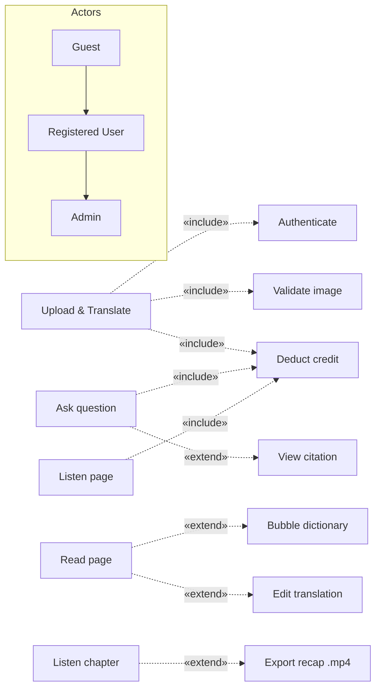

# StoryLens — Requirements Supplement (LN04 / LN05)

> **Mục đích:** bổ sung 2 mục môn CNPM yêu cầu nhưng SRS/UC‑spec hiện chưa ghi tường minh:
> **(A)** quan hệ **«include» / «extend» / generalization** trong mô hình use case (LN05); và
> **(B)** **Requirements Validation** theo 5 tiêu chí (LN05). Bám vào use case & requirement thật của
> StoryLens (UC01–UC0n, F01–F09 trong `run_ucspec_v1.docx` + `SRS - StoryLens.md`).

---

## A. Quan hệ Use Case: «include» / «extend» / generalization

### A.1 Bảng quan hệ (LN05)

| Base use case | Quan hệ | Use case liên quan | Ý nghĩa |
|---|---|---|---|
| *Mọi UC cần đăng nhập* (Upload, Q&A, Listen, Publish, Bookmark…) | **«include»** | **Authenticate user** | Hành vi **bắt buộc, luôn xảy ra** — gom lại 1 chỗ (DRY) |
| **Upload & Translate page** | **«include»** | **Validate image** (chống MIME‑spoof) | Luôn kiểm tra ảnh trước khi xử lý |
| **Upload & Translate page** | **«include»** | **Deduct credit** | Mỗi trang dịch **luôn** trừ 1 credit |
| **Ask question (Q&A)** | **«include»** | **Deduct credit** | Mỗi câu hỏi **luôn** trừ 1 credit |
| **Ask question (Q&A)** | **«extend»** | **View citation / source** | *Tuỳ chọn* — chỉ khi người dùng bấm xem trích dẫn |
| **Read translated page** | **«extend»** | **Look up bubble (Dictionary)** | *Tuỳ chọn* — double‑click bong bóng mới bung từ điển |
| **Read translated page** | **«extend»** | **Edit / review translation** | *Tuỳ chọn* — chỉ khi chủ sở hữu sửa bản dịch |
| **Listen to page (Narration)** | **«include»** | **Deduct credit** | Mỗi trang nghe **luôn** trừ credit |
| **Listen to chapter** | **«extend»** | **Export recap video (.mp4)** | *Tuỳ chọn* — điều kiện: host có `ffmpeg` |
| **Import chapter (scrape/MangaDex)** | **«include»** | **Validate source URL (SSRF allowlist)** | Luôn kiểm domain trước khi tải |
| **Publish chapter to library** | **«extend»** | **Comment on chapter** | *Tuỳ chọn* — chỉ trên chương đã publish |

### A.2 Generalization

- **Actor generalization:** `Admin` **là một** `Registered User` (kế thừa mọi UC của user + thêm UC
  quản trị: analytics, moderation, health, model‑monitor, app‑settings).
  `Registered User` **là một** `Guest` mở rộng (Guest chỉ đọc thư viện công khai/forum).
- **Use‑case generalization:** `Authenticate` được **chuyên biệt hoá** thành `Login by email/password`
  và `Reset password` (cùng mục tiêu xác thực, cơ chế khác nhau).

### A.3 Sơ đồ quan hệ (mermaid, minh hoạ)

> **Lưu ý hướng mũi tên (LN05):** «include» đi từ **base → included** (base *cần* nó); «extend» đi từ
> **extension → base** (phần mở rộng *cắm vào* base tại extension point). Ở đây vẽ dạng nhãn cho dễ đọc.

---

## B. Requirements Validation — 5 tiêu chí (LN05)

Kiểm định SRS theo 5 tiêu chí, kèm **bằng chứng** và **cách kiểm** cho từng tiêu chí.

| Tiêu chí | Câu hỏi | Kết quả cho StoryLens | Bằng chứng / cách kiểm |
|---|---|---|---|
| **Validity** (đúng nhu cầu) | Yêu cầu có phản ánh đúng cái người dùng thực sự cần? | ✅ Đạt | Personas trong Vision → mỗi F01–F09 map tới nhu cầu 1 persona; review với "khách hàng" (giảng viên/UAT) |
| **Consistency** (nhất quán) | Có yêu cầu nào mâu thuẫn nhau? | ✅ Đạt | Không có xung đột; ví dụ credit: "1 credit = 1 dịch **hoặc** 1 Q&A" áp dụng đồng nhất ở upload/qa/narrate |
| **Completeness** (đầy đủ) | Đã bao phủ mọi chức năng + mọi ràng buộc? | ⚠️→✅ | Bao phủ F01–F09 + NFR; RTM (`management/*.xlsx`) đảm bảo Req↔UC↔Module↔Test không sót; **edge case** (0 credit, ảnh lỗi, chương rỗng) có trong test |
| **Realism** (khả thi) | Cài được với công nghệ/ngân sách/thời gian? | ✅ Đạt | Zero‑budget: dùng free‑tier (Render/Vercel/Supabase/HF), model self‑hosted VLM trên pod → NFR chi phí = $0 khả thi (đã chạy thật) |
| **Verifiability** (kiểm chứng được) | Có test được từng yêu cầu không? | ✅ Đạt | Mọi NFR có **số đo** (CER≤5%, p95<3s, upload≤20 MB, rate‑limit); mọi FR có test case (61 case/10 UC + pytest/vitest/Playwright) |

### B.1 Kỹ thuật validation đã dùng (LN05)
1. **Requirements review** — review chéo trong nhóm mỗi sprint (weekly report ghi nhận).
2. **Prototyping** — `ui_prototype.docx` + app chạy thật để khách xác nhận sớm.
3. **Test‑case generation** — sinh test case *từ* use case (`test_cases.docx`); nếu một yêu cầu
   **không viết nổi test** ⇒ nó *chưa verifiable* ⇒ phải viết lại (đây là cách LN05 dùng test để soi lỗi mơ hồ).

### B.2 Ví dụ sửa yêu cầu mơ hồ (imprecision → precise)
| Bản mơ hồ (tránh) | Bản đã tinh chỉnh (dùng) |
|---|---|
| "Hệ thống dịch **nhanh**" | "Hệ thống **shall** trả kết quả dịch 1 trang với **p95 < N giây** (đo trên tập chuẩn)" |
| "OCR **chính xác**" | "OCR **shall** đạt **CER ≤ 5%** trên tập test Manga109‑s (split‑by‑title, seed 42)" |
| "Upload **ảnh hợp lệ**" | "Chỉ chấp nhận **jpg/jpeg/png/webp**, mỗi file **≤ 20 MB**, được `verify()` lại bằng Pillow" |

> Khuyến nghị: chèn Mục B (5 checks + bảng B.2) vào SRS như một tiết "§X Requirements Validation", và
> chèn Mục A vào `run_ucspec` phần *Relationships* của từng UC. Nội dung trên đã ở dạng sẵn để dán.
