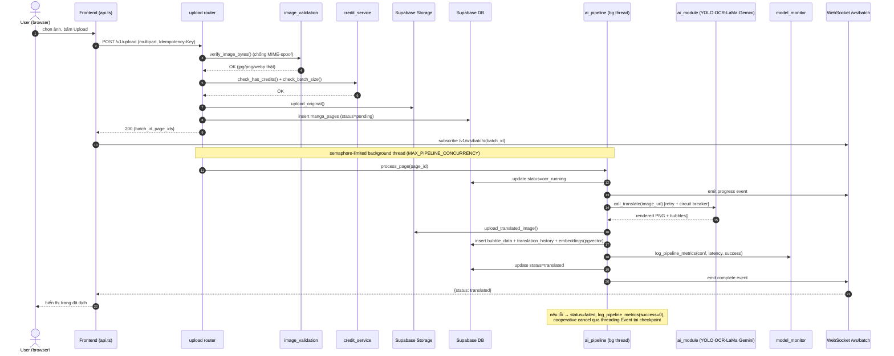
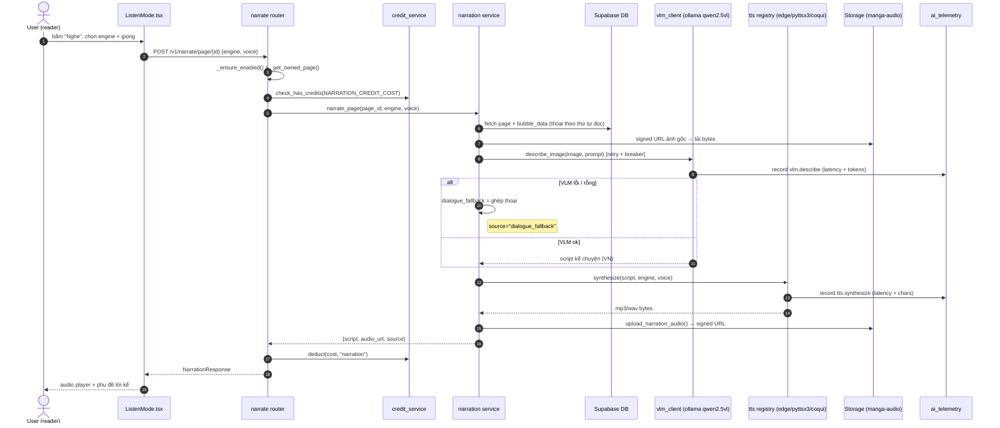

# StoryLens — Sequence Diagrams (Detailed Design · dynamic view)

> **Mục đích:** bổ sung **biểu đồ tuần tự (sequence diagram)** cho phần *Detailed Design* của môn
> CNPM (LN02 §Design → SDD; LN03b §system design; LN06). Ba biểu đồ dưới mô tả **hành vi động** của
> 3 use case lõi, **suy ra trực tiếp từ code thật** (router + service), bổ sung cho class diagram
> (`storylens-sad.drawio` F1) vốn chỉ mô tả cấu trúc tĩnh.
>
> Nguồn code: `backend/app/routers/{upload,qa,narration}.py`,
> `services/{ai_pipeline,ai_module_client,rag,narration,vlm_client,tts,ai_telemetry}.py`.

---

## UC-01 — Upload & Translate a manga page

Actor tải ảnh; hệ thống dịch bất đồng bộ (background thread) và đẩy tiến độ qua WebSocket.



---

## UC-02 — Ask a question (RAG Q&A)

Actor hỏi về nội dung truyện; hệ thống tìm ngữ cảnh bằng vector search rồi sinh câu trả lời có trích dẫn.

```mermaid
sequenceDiagram
    autonumber
    actor U as User
    participant FE as Frontend (api.ts)
    participant QA as qa router
    participant CR as credit_service
    participant RAG as rag.answer_question
    participant GE as Gemini (embedding + LLM, key-pool)
    participant DB as pgvector (embeddings)
    participant TEL as ai_telemetry
    participant AC as achievements

    U->>FE: nhập câu hỏi
    FE->>QA: POST /v1/qa {question, page_id?}
    QA->>CR: check_has_credits(1)
    CR-->>QA: OK
    QA->>RAG: answer_question(question, page_id)
    RAG->>GE: embed_content(question)
    GE-->>RAG: query embedding (1536-d)
    RAG->>DB: cosine search top-k=5
    DB-->>RAG: bubble chunks + similarity
    RAG->>GE: generate_content(context + question)
    Note over RAG,GE: xoay vòng nhiều API key;<br/>ai_telemetry.track("gemini","qa.answer")
    GE-->>RAG: answer + usage_metadata(tokens)
    RAG->>TEL: record latency + tokens + cost
    alt Gemini rỗng / hết key
        RAG-->>QA: _context_fallback_answer(context)
    else thành công
        RAG-->>QA: answer + sources[]
    end
    QA->>CR: deduct(1, "qa")
    QA->>DB: insert qa_history
    QA->>AC: check_and_unlock()
    QA-->>FE: {answer, sources, confidence}
    FE-->>U: câu trả lời + trích dẫn click được
```

---

## UC-03 — Listen mode (AI narration + TTS)

Actor bấm "Nghe"; VLM mô tả trang + lồng thoại → TTS đọc thành audio. Có **fallback** khi VLM chết.



---

### Ghi chú thiết kế (bám LN06)
- **Bất đồng bộ + cooperative cancel** (UC-01): tách UI khỏi pipeline nặng → đáp ứng NFR *performance*
  & *responsiveness*; huỷ tại checkpoint qua `threading.Event`.
- **Resilience** (UC-02, UC-03): mọi lời gọi model ngoài đều có **retry + circuit breaker + fallback**
  (Gemini key-rotation, VLM→đọc thoại) → NFR *dependability/availability*.
- **Observability** (mọi UC): `model_monitor` + `ai_telemetry` ghi latency/token/cost, không bao giờ
  ném lỗi vào luồng người dùng → NFR *maintainability/operability*.
