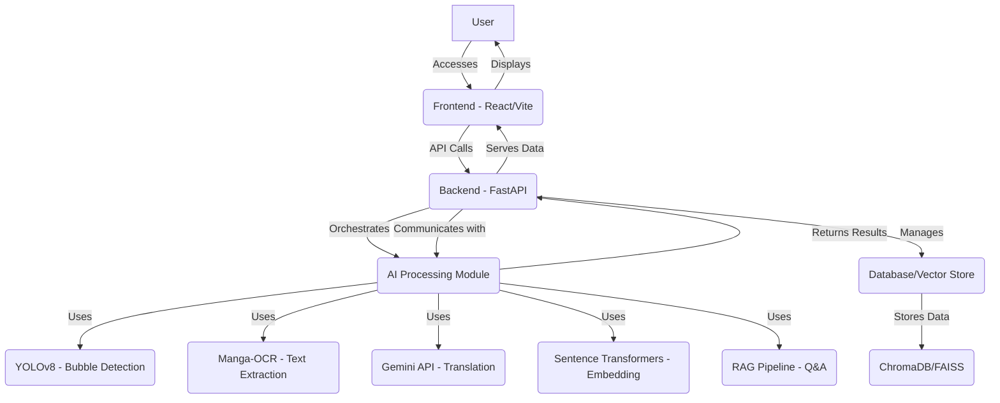
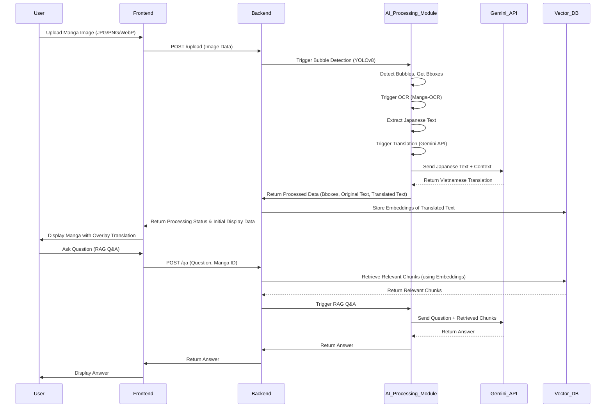
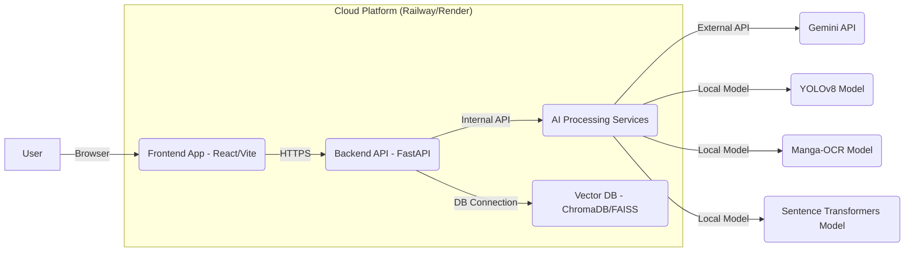

# Software Architecture Document (SAD) - StoryLens

## 1. Introduction
### 1.1 Purpose
Tài liệu này mô tả kiến trúc phần mềm của hệ thống StoryLens, cung cấp cái nhìn tổng quan về cấu trúc, các thành phần chính, mối quan hệ giữa chúng và các nguyên tắc thiết kế. Mục tiêu là đảm bảo sự hiểu biết chung về hệ thống cho tất cả các bên liên quan và hướng dẫn quá trình phát triển.

### 1.2 Scope
Tài liệu này bao gồm kiến trúc tổng thể của hệ thống StoryLens, bao gồm các lớp (layers), module, thành phần AI, cơ sở dữ liệu và cách chúng tương tác với nhau. Nó cũng đề cập đến các quyết định kiến trúc quan trọng và lý do đằng sau chúng.

### 1.3 Definitions, Acronyms, and Abbreviations
| Thuật ngữ | Định nghĩa |
| :--- | :--- |
| **SAD** | Software Architecture Document - Tài liệu kiến trúc phần mềm. |
| **API** | Application Programming Interface - Giao diện lập trình ứng dụng. |
| **UI** | User Interface - Giao diện người dùng. |
| **UX** | User Experience - Trải nghiệm người dùng. |
| **DB** | Database - Cơ sở dữ liệu. |
| **RAG** | Retrieval-Augmented Generation - Kỹ thuật kết hợp tìm kiếm thông tin và sinh văn bản. |

---

## 2. Architectural Representation

### 2.1 High-Level Architecture
Hệ thống StoryLens được thiết kế theo kiến trúc **Layered Architecture** với các thành phần chính được tách biệt rõ ràng để dễ dàng mở rộng và bảo trì. Các lớp bao gồm Presentation Layer, Application Layer, Business Logic Layer và Data Access Layer.

### 2.2 Component Breakdown

#### 2.2.1 Presentation Layer (Frontend)
- **Công nghệ:** React, Vite, TypeScript, TailwindCSS.
- **Mô tả:** Cung cấp giao diện người dùng tương tác, bao gồm các trang upload, reader, lịch sử và Q&A. Giao tiếp với Backend thông qua RESTful API.
- **Các thành phần chính:**
    - **Upload Component:** Xử lý việc tải ảnh đơn lẻ hoặc batch.
    - **Reader Component:** Hiển thị ảnh manga gốc và overlay bản dịch.
    - **History Component:** Hiển thị lịch sử các trang/series đã dịch.
    - **Q&A Chatbot:** Giao diện để người dùng đặt câu hỏi và nhận câu trả lời từ RAG.

#### 2.2.2 Application Layer (Backend)
- **Công nghệ:** FastAPI, Python.
- **Mô tả:** Cung cấp các API cho Frontend, điều phối các tác vụ xử lý AI, quản lý dữ liệu và tương tác với cơ sở dữ liệu.
- **Các thành phần chính:**
    - **API Gateway:** Tiếp nhận yêu cầu từ Frontend, xác thực và ủy quyền.
    - **Task Orchestrator:** Quản lý luồng xử lý các tác vụ AI (upload, OCR, dịch, RAG).
    - **Job Queue:** Hàng đợi cho các tác vụ xử lý nặng (ví dụ: Celery).
    - **Database Service:** Tương tác với cơ sở dữ liệu để lưu trữ và truy xuất dữ liệu.

#### 2.2.3 Business Logic Layer (AI Processing Module)
- **Mô tả:** Chứa các module AI cốt lõi thực hiện các chức năng chính của hệ thống.
- **Các thành phần chính:**
    - **Bubble Detection Module:** Sử dụng YOLOv8 để phát hiện các speech bubble.
    - **OCR Module:** Sử dụng Manga-OCR để trích xuất văn bản tiếng Nhật.
    - **Translation Module:** Tương tác với Gemini API để dịch văn bản, có xử lý ngữ cảnh và glossary.
    - **Embedding Module:** Sử dụng Sentence Transformers để tạo vector embeddings từ văn bản.
    - **RAG Q&A Module:** Xử lý câu hỏi của người dùng, tìm kiếm thông tin liên quan từ Vector DB và sinh câu trả lời.

#### 2.2.4 Data Access Layer (Database/Vector Store)
- **Công nghệ:** ChromaDB/FAISS (in-memory cho MVP, có thể nâng cấp).
- **Mô tả:** Lưu trữ dữ liệu cần thiết cho hệ thống, bao gồm metadata truyện, văn bản gốc, bản dịch, vector embeddings và lịch sử Q&A.
- **Các thành phần chính:**
    - **Metadata Storage:** Lưu trữ thông tin về truyện, trang, trạng thái xử lý.
    - **Vector Database:** Lưu trữ vector embeddings của các chunk văn bản để phục vụ RAG.
    - **History Storage:** Lưu trữ lịch sử các phiên dịch và Q&A của người dùng.

---

## 3. Data Flow

---

## 4. Architectural Goals and Constraints

### 4.1 Goals
- **Khả năng mở rộng (Scalability):** Dễ dàng mở rộng các module AI và xử lý hàng đợi để đáp ứng lượng người dùng tăng lên.
- **Khả năng bảo trì (Maintainability):** Kiến trúc module hóa giúp dễ dàng cập nhật, sửa lỗi và thay thế các thành phần.
- **Hiệu suất (Performance):** Đảm bảo thời gian phản hồi nhanh cho các tương tác người dùng và xử lý AI hiệu quả.
- **Độ tin cậy (Reliability):** Xử lý lỗi mạnh mẽ, có cơ chế retry và fallback cho các dịch vụ bên ngoài.

### 4.2 Constraints
- **Ngân sách:** Ưu tiên các giải pháp free-tier hoặc chi phí thấp cho MVP.
- **Thời gian:** Phát triển nhanh chóng để ra mắt MVP.
- **Phụ thuộc API:** Phụ thuộc vào hiệu suất và chính sách của Gemini API.
- **Tài nguyên AI:** Hạn chế về GPU cho training/inference, ưu tiên CPU cho MVP.

---

## 5. Technology Stack

| Lớp / Chức năng | Công nghệ | Mục đích |
| :--- | :--- | :--- |
| **Frontend** | React, Vite, TypeScript, TailwindCSS | Xây dựng giao diện người dùng web động và hiện đại. |
| **Backend** | FastAPI, Python | Xây dựng API hiệu suất cao, dễ phát triển và bảo trì. |
| **Bubble Detection** | YOLOv8 | Phát hiện chính xác các vùng thoại trong ảnh manga. |
| **OCR** | Manga-OCR | Trích xuất văn bản tiếng Nhật từ ảnh manga với độ chính xác cao. |
| **Translation** | Gemini API | Dịch văn bản tiếng Nhật sang tiếng Việt với ngữ cảnh. |
| **Embedding** | Sentence Transformers (all-MiniLM-L6-v2) | Tạo vector embeddings cho văn bản để tìm kiếm ngữ nghĩa. |
| **Vector Database** | ChromaDB/FAISS (in-memory) | Lưu trữ và truy vấn vector embeddings hiệu quả cho RAG. |
| **Job Queue** | Celery (hoặc tương đương) | Xử lý các tác vụ AI bất đồng bộ và theo hàng đợi. |
| **Version Control** | Git, GitHub | Quản lý mã nguồn và cộng tác phát triển. |
| **Deployment** | Railway/Render (free tier) | Triển khai ứng dụng lên môi trường cloud. |

---

## 6. Deployment View

Hệ thống sẽ được triển khai trên các nền tảng cloud miễn phí hoặc chi phí thấp cho MVP. Frontend và Backend có thể được triển khai độc lập.

---

## 7. Security Considerations
- **API Key Management:** API keys sẽ được lưu trữ an toàn trong biến môi trường, không commit vào mã nguồn.
- **Input Validation:** Tất cả các input từ người dùng (đặc biệt là file upload) sẽ được kiểm tra định dạng và kích thước để ngăn chặn các cuộc tấn công.
- **Session Management:** Quản lý session người dùng an toàn, chỉ lưu trữ thông tin cần thiết.
- **Data Privacy:** Đảm bảo dữ liệu người dùng (ảnh, lịch sử dịch) được xử lý và lưu trữ một cách riêng tư, tuân thủ các quy định về bảo mật dữ liệu.

---

## 8. Future Considerations
- **Mở rộng cơ sở dữ liệu:** Nâng cấp từ ChromaDB/FAISS in-memory lên các giải pháp persisted Vector DB (ví dụ: Pinecone, Weaviate) hoặc RDBMS (PostgreSQL) khi cần.
- **Tối ưu hóa AI:** Nghiên cứu và tích hợp các mô hình AI tiên tiến hơn để cải thiện độ chính xác và hiệu suất.
- **Hỗ trợ đa ngôn ngữ:** Mở rộng để hỗ trợ dịch sang các ngôn ngữ khác ngoài tiếng Việt.
- **Tính năng cộng đồng:** Cho phép người dùng chia sẻ bản dịch, đóng góp glossary.
